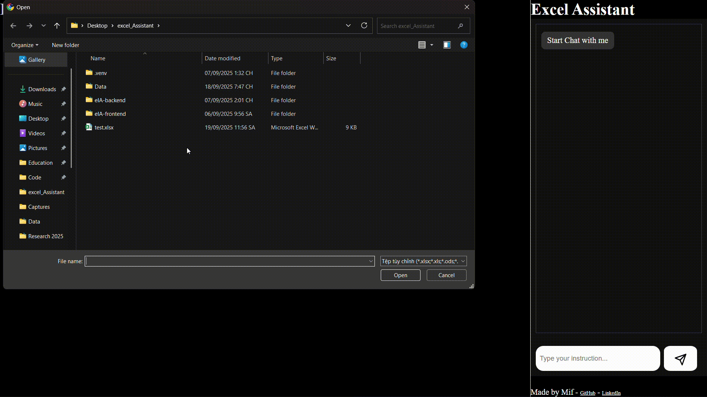
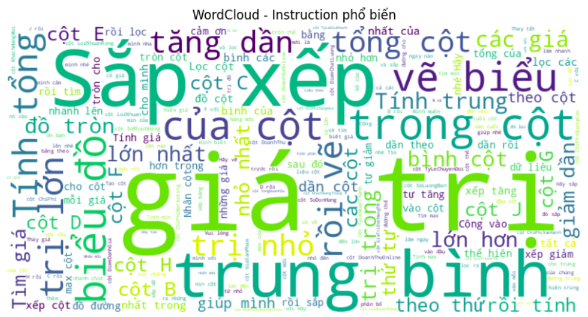
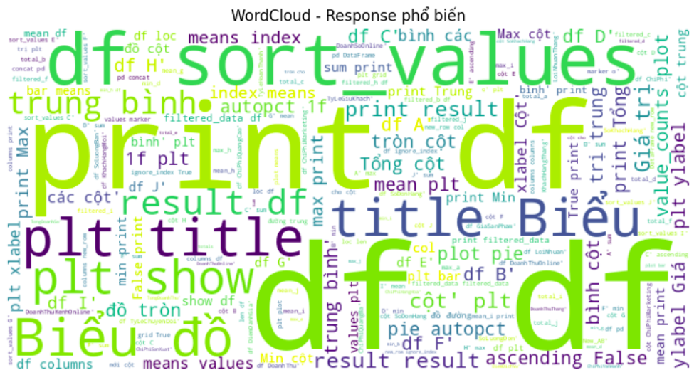
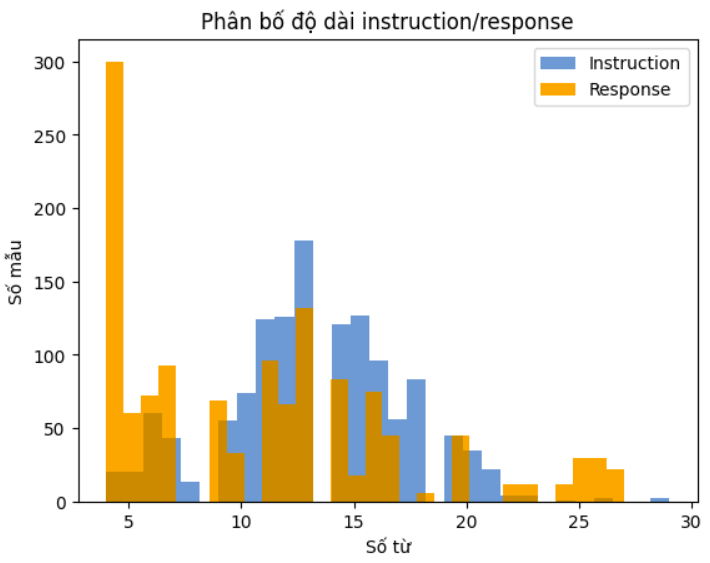

<h1 align="center">📊 ExceLIA – Excel AI Assistant</h1>

<p align="center">
  <a href="https://www.kaggle.com/">
    
  </a>
  <a href="https://fastapi.tiangolo.com/">
    
  </a>
  <a href="https://reactjs.org/">
    
  </a>
  <a href="https://vitejs.dev/">
    
  </a>
  <a href="https://huggingface.co/codellama/CodeLlama-7b-Instruct-hf">
    
  </a>
  <a href="https://www.python.org/">
    
  </a>
  <a href="https://pandas.pydata.org/">
    
  </a>
  <a href="https://matplotlib.org/">
    
  </a>
  <a href="https://pytorch.org/">
    
  </a>
  <a href="https://huggingface.co/">
    
  </a>
  <a href="https://opensource.org/licenses/MIT">
    
  </a>
  <a href="https://openai.com/">
    
  </a>
</p>


ExceLIA is an **AI assistant for Excel** designed to help users:

- Quickly analyze Excel/CSV data.
- Automatically generate Python/pandas code from natural language commands.
- Visualize data with charts and images.
- Interact through an intuitive chat interface.

---

## Key Features

- **Natural language understanding**: For example, "Calculate the sum of column A" → generates pandas code + prints the result.
- **Excel/CSV data processing** using Python (pandas, matplotlib).
- **Visual data representation** (bar charts, line charts, etc.).
- **React frontend** to display chat, code, and output.
- **FastAPI backend** connecting the frontend with the AI model.
- **AI model**: Fine-tuned from **`codellama/CodeLlama-7b-Instruct-hf`** to simulate an Excel assistant.
## System Architecture

The architecture of ExceLIA illustrates the data and command flow from the user to the AI model and back:

```mermaid
flowchart LR
    User["User"] -->|Upload Excel or CSV| Frontend["Frontend (React)"]
    User -->|Enter Command| Frontend
    Frontend -->|Send Command and Data| Backend["Backend (FastAPI)"]
    Backend -->|Request AI Code| Model["AI Model (Fine-tuned LLM)"]
    Model -->|Return Generated Code| Backend
    Backend -->|Execute Code in Sandbox| Backend
    Backend -->|Return Output: Result or Chart| Frontend
    Frontend -->|Return Output: Result or Chart| User
```
## Installation & Running the Project

Follow these steps to set up and run ExceLIA locally:

### 1. Clone the repository
```bash
git clone https://github.com/your-username/ExceLIA.git
cd ExceLIA
```
### 2. Backend (FastAPI)
```bash
cd backend
pip install -r requirements.txt
uvicorn main:app --reload
```
The backend server will run at: http://127.0.0.1:8000
### 3. Frontend (React)
Install dependencies listed in `requirements-frontend.txt`:
```bash
cd frontend
npm install
npm run dev
```
The frontend application will run at: http://localhost:3000
#### Demo
| STT | Demo |
|------|-------------|
|1|  | 
|2|  |
|3|  | 


## Data and Model

### Dataset
- Format: HuggingFace Dataset object  
```python
Dataset({
    features: ['instruction', 'response'],
    num_rows: 1311
})
```
### Features:
- instruction: User command in natural language.
- response: Corresponding Python/pandas code.
### Example:
``` json
{
  "instruction": "Tính tổng cột A rồi sắp xếp tăng dần theo cột B",
  "response": "total_a = df['A'].sum()\ndf = df.sort_values('B')\nprint('Tổng cột A:', total_a)\nprint(df)"
}
```
### Visualizations:

| Instruction WordCloud | Response WordCloud | Instruction/Response Length Distribution |
|----------------------|------------------|----------------------------------------|
|  |  |  |

### AI Model
- **Model used:** `codellama/CodeLlama-7b-Instruct-hf` (fine-tuned for Excel assistant tasks)
- **Purpose:** 
  - Convert natural language commands into Python/pandas code.
  - Generate visualizations (charts) if requested.
- **Framework:** PyTorch / HuggingFace Transformers
- **Input to model:** User command + optionally a snippet of the dataset.
- **Output from model:** Python code to execute the command.
- **Architecture**
```mermaid
flowchart LR
    Instruction["User Instruction (Natural Language)"] -->|Tokenize| Tokenizer["Tokenizer (BPE / SentencePiece)"]
    Tokenizer -->|Tokens| LLM["CodeLlama-7b-Instruct LLM\n(Decoder-only Transformer)"]
    
    subgraph Transformer Layers
        LLM --> Layer1["Layer 1: Multi-head Self-Attention + MLP + RoPE + LayerNorm"]
        Layer1 --> Layer2["Layer 2: Multi-head Self-Attention + MLP + RoPE + LayerNorm"]
        Layer2 --> Layer3["..."]
        Layer3 --> LayerN["Layer 32: Multi-head Self-Attention + MLP + RoPE + LayerNorm"]
    end

    LayerN -->|Generated Tokens| Output["Generated Python/Pandas Code"]
```
- **Layer Components Explained**

  - Multi-head Self-Attention: Allows the model to focus on different parts of the input sequence simultaneously, helping it understand relationships between words or tokens.
  
  - MLP (Multi-Layer Perceptron): Adds nonlinear transformations so the model can learn more complex patterns.
  
  - RoPE (Rotary Position Embedding): Improves how the model handles the order of tokens by using rotary-based positional embeddings, helping the model better understand sequence positions.
  
  - LayerNorm: Normalizes the output of each layer to increase training stability and speed.

## Author

This project is developed by **[mif](https://github.com/toilaMif) - **[LinkedIn](https://www.linkedin.com/in/th%C3%A0nh-trung-nguy%E1%BB%85n-500001382/)

